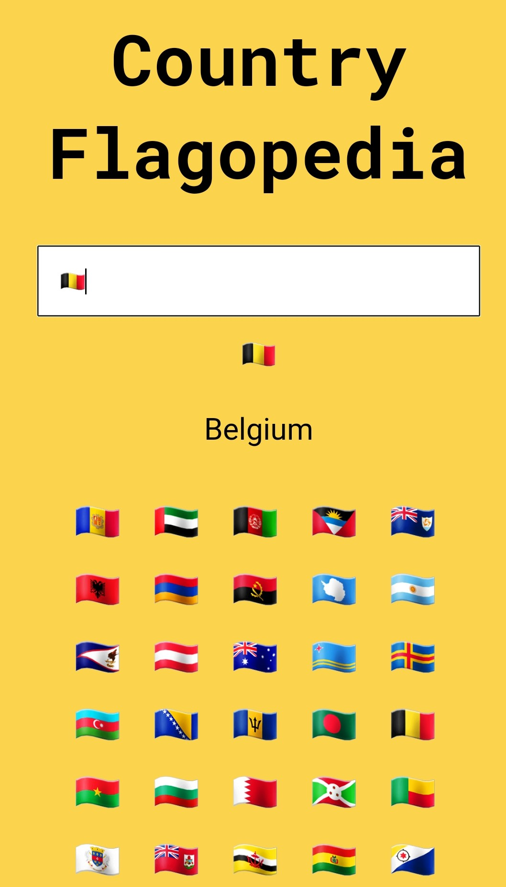

<h1 align="center">Country Flag Interpreter🇮🇳</h1>

A country Flag interpreter which interprets the corresponding country name for a flag emoji, so that you are always updated with knowledge of Flags😉

<h1 align="center">Links🌐</h1>

<h2 align="center">Check out this App <a href="https://nb40z.csb.app/">here</a>!🚀</h2>

<h1 align="center">Images/Screenshots<h1>

## 👷 Built with

- HTML
- CSS
- Reactjs